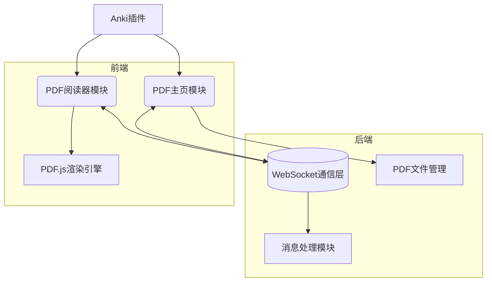
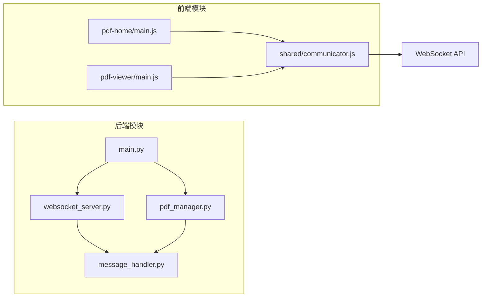
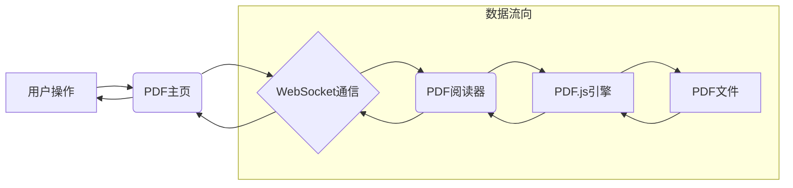

# project_initialize 项目架构与设计文档

## 1. 整体架构图



## 2. 分层设计和核心组件

### 2.1 分层架构

#### 2.1.1 后端层（PyQt6）
- **主应用模块**：负责创建主窗口和集成QtWebEngine
- **WebSocket服务器模块**：处理前端连接和消息通信
- **PDF文件管理模块**：管理PDF文件列表和文件操作
- **消息处理模块**：处理前后端消息协议

#### 2.1.2 前端层（Vanilla JS）
- **PDF主页模块**：实现文件列表展示和管理功能
- **PDF阅读器模块**：集成PDF.js实现PDF阅读功能
- **通信模块**：封装WebSocket通信接口

### 2.2 核心组件

#### 2.2.1 后端核心组件
- `main.py`：应用入口，初始化主窗口和WebSocket服务器
- `websocket_server.py`：WebSocket服务器实现
- `pdf_manager.py`：PDF文件管理实现
- `message_handler.py`：消息处理实现

#### 2.2.2 前端核心组件
- `pdf-home/index.html`：PDF主页页面结构
- `pdf-home/main.js`：PDF主页逻辑实现
- `pdf-viewer/index.html`：PDF阅读器页面结构
- `pdf-viewer/main.js`：PDF阅读器逻辑实现
- `shared/communicator.js`：WebSocket通信封装

## 3. 模块依赖关系图



## 4. 接口契约定义

### 4.1 后端WebSocket接口

#### 4.1.1 连接接口
- **接口名称**：WebSocket连接
- **请求方式**：WebSocket握手
- **请求地址**：`ws://localhost:{{port}}/`
- **请求参数**：无
- **响应数据**：连接成功建立

#### 4.1.2 获取PDF列表接口
- **接口名称**：getPdfList
- **请求方向**：前端 -> 后端
- **请求参数**：无
- **响应数据**：
  ```json
  {
    "type": "pdfList",
    "data": [
      {
        "id": "文件唯一标识",
        "name": "文件名",
        "path": "文件路径"
      }
    ]
  }
  ```

#### 4.1.3 添加PDF文件接口
- **接口名称**：addPdf
- **请求方向**：前端 -> 后端
- **请求参数**：
  ```json
  {
    "type": "addPdf",
    "data": {
      "path": "文件路径"
    }
  }
  ```
- **响应数据**：
  ```json
  {
    "type": "addPdfResult",
    "success": true,
    "message": "操作结果信息"
  }
  ```

#### 4.1.4 删除PDF文件接口
- **接口名称**：removePdf
- **请求方向**：前端 -> 后端
- **请求参数**：
  ```json
  {
    "type": "removePdf",
    "data": {
      "id": "文件唯一标识"
    }
  }
  ```
- **响应数据**：
  ```json
  {
    "type": "removePdfResult",
    "success": true,
    "message": "操作结果信息"
  }
  ```

### 4.2 前端通信接口

#### 4.2.1 消息发送接口
- **接口名称**：sendMessage
- **功能描述**：向后端发送消息
- **参数**：message（消息对象）

#### 4.2.2 消息接收回调
- **接口名称**：onMessage
- **功能描述**：接收后端消息的回调函数
- **参数**：message（消息对象）

## 5. 数据流向图



## 6. 异常处理策略

### 6.1 WebSocket连接异常
- **异常场景**：WebSocket连接失败、连接中断
- **处理策略**：
  1. 前端实现连接重试机制，最多重试3次
  2. 显示连接状态提示信息给用户
  3. 记录连接异常日志

### 6.2 PDF文件操作异常
- **异常场景**：文件不存在、文件格式错误、文件读取权限不足
- **处理策略**：
  1. 后端捕获文件操作异常并返回错误信息
  2. 前端显示友好的错误提示
  3. 记录文件操作异常日志

### 6.3 PDF渲染异常
- **异常场景**：PDF.js渲染失败、不支持的PDF格式
- **处理策略**：
  1. 捕获PDF.js渲染错误事件
  2. 显示渲染失败提示信息
  3. 提供重新加载选项

### 6.4 消息处理异常
- **异常场景**：未知消息类型、消息格式错误
- **处理策略**：
  1. 后端验证消息格式，拒绝处理无效消息
  2. 记录无效消息日志
  3. 必要时向前端发送错误响应