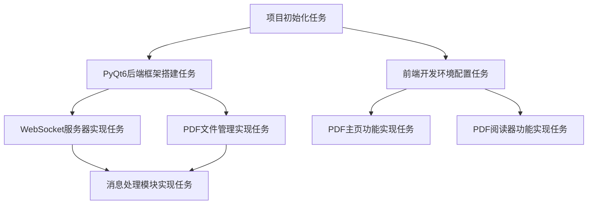

# project_initialize 项目任务依赖图

## 依赖关系说明

1. **项目初始化任务**是所有其他任务的基础，必须首先完成。
2. **PyQt6后端框架搭建任务**和**前端开发环境配置任务**可以并行进行，它们都依赖于项目初始化任务。
3. **WebSocket服务器实现任务**和**PDF文件管理实现任务**可以并行进行，它们都依赖于PyQt6后后端框架搭建任务。
4. **PDF主页功能实现任务**和**PDF阅读器功能实现任务**可以并行进行，它们都依赖于前端开发环境配置任务。
5. **消息处理模块实现任务**依赖于WebSocket服务器实现任务和PDF文件管理实现任务。