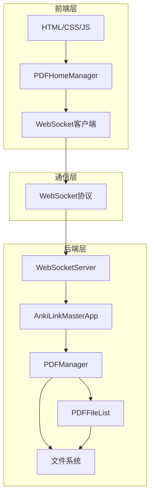
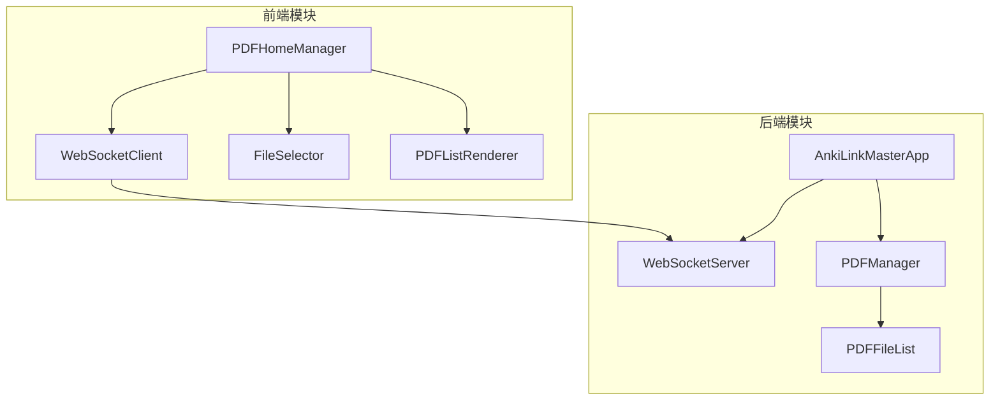
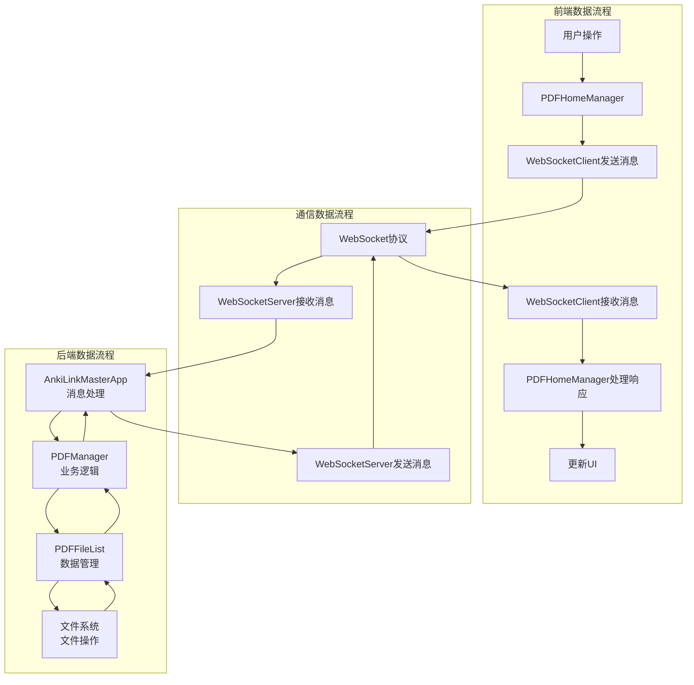

# Anki LinkMaster PDFJS - task2-homepageDev 架构设计文档

## 1. 整体架构图



整体架构采用经典的前后端分离模式，通过WebSocket进行实时通信。前端负责用户界面展示和交互，后端负责PDF文件的管理和业务逻辑处理。这种架构设计使得系统具有良好的可扩展性和可维护性，同时能够提供流畅的用户体验。

## 2. 分层设计和核心组件

### 2.1 前端层

#### HTML/CSS/JS
- **功能描述**：负责PDF主页的界面展示和用户交互
- **关键组件**：PDF列表容器、文件选择按钮、PDF卡片、操作按钮
- **技术选型**：HTML5、CSS3、JavaScript

#### PDFHomeManager
- **功能描述**：管理PDF主页的业务逻辑
- **关键方法**：初始化WebSocket连接、处理文件选择、管理PDF列表、处理操作请求
- **设计要点**：采用模块化设计，将业务逻辑与界面展示分离

#### WebSocket客户端
- **功能描述**：负责与后端WebSocket服务器进行通信
- **关键功能**：建立连接、发送消息、接收消息、处理连接状态
- **设计要点**：实现可靠的消息发送和接收机制，处理连接异常

### 2.2 通信层

#### WebSocket协议
- **功能描述**：实现前后端之间的双向实时通信
- **消息格式**：JSON格式，包含消息类型、操作数据和唯一标识符
- **设计要点**：定义统一的消息格式和通信协议，确保消息的正确传递

### 2.3 后端层

#### WebSocketServer
- **功能描述**：负责处理前端WebSocket连接和消息
- **关键方法**：启动/停止服务器、管理客户端连接、接收/发送消息
- **设计要点**：使用PyQt6的QWebSocketServer实现，支持多客户端连接

#### AnkiLinkMasterApp
- **功能描述**：管理整个应用程序的生命周期
- **关键方法**：初始化PDF管理器和WebSocket服务器、设置消息处理逻辑、处理应用关闭
- **设计要点**：作为应用程序的核心，协调各个组件的工作

#### PDFManager
- **功能描述**：负责PDF文件的添加、删除和列表管理
- **关键方法**：add_file、remove_file、get_files、add_files_from_directory
- **设计要点**：使用信号-槽机制通知文件变更，支持批量操作

#### PDFFileList
- **功能描述**：管理PDF文件列表的数据结构
- **关键方法**：add_file、remove_file、get_all_files、search_files
- **设计要点**：实现高效的文件列表管理和搜索功能

#### 文件系统
- **功能描述**：存储和访问PDF文件
- **关键操作**：文件读取、文件状态检查、路径解析
- **设计要点**：确保文件操作的安全性和可靠性

## 3. 模块依赖关系图



### 依赖关系说明

1. **前端内部依赖**：
   - PDFHomeManager 依赖 WebSocketClient 进行消息通信
   - PDFHomeManager 依赖 FileSelector 处理文件选择
   - PDFHomeManager 依赖 PDFListRenderer 渲染PDF列表

2. **后端内部依赖**：
   - AnkiLinkMasterApp 依赖 WebSocketServer 管理WebSocket连接
   - AnkiLinkMasterApp 依赖 PDFManager 处理PDF相关操作
   - PDFManager 依赖 PDFFileList 管理文件列表数据

3. **前后端依赖**：
   - WebSocketClient 依赖 WebSocketServer 进行通信

## 4. 接口契约定义

### 4.1 WebSocket消息格式

所有WebSocket消息采用JSON格式，包含以下字段：
- `type`：消息类型
- `data`：消息数据
- `id`：消息唯一标识符（可选）

### 4.2 消息类型定义

#### 4.2.1 前端发送到后端的消息

1. **添加PDF文件**
   - 消息类型：`add_pdf`
   - 数据格式：
     ```json
     {
       "type": "add_pdf",
       "data": {
         "file_name": "example.pdf",
         "file_path": "C:\\path\\to\\example.pdf"
       },
       "id": "message_id_123"
     }
     ```
   - 功能描述：请求后端添加指定的PDF文件

2. **获取PDF列表**
   - 消息类型：`get_pdf_list`
   - 数据格式：
     ```json
     {
       "type": "get_pdf_list",
       "data": {},
       "id": "message_id_456"
     }
     ```
   - 功能描述：请求后端返回当前所有的PDF文件列表

3. **删除PDF文件**
   - 消息类型：`remove_pdf`
   - 数据格式：
     ```json
     {
       "type": "remove_pdf",
       "data": {
         "file_id": "file_id_789"
       },
       "id": "message_id_789"
     }
     ```
   - 功能描述：请求后端删除指定的PDF文件

#### 4.2.2 后端发送到前端的消息

1. **操作成功响应**
   - 消息类型：`success`
   - 数据格式：
     ```json
     {
       "type": "success",
       "data": {
         "original_type": "add_pdf",
         "result": {"file_id": "file_id_789"}
       },
       "id": "message_id_123"
     }
     ```
   - 功能描述：通知前端操作成功

2. **操作失败响应**
   - 消息类型：`error`
   - 数据格式：
     ```json
     {
       "type": "error",
       "data": {
         "original_type": "add_pdf",
         "code": "INVALID_FILE",
         "message": "无效的PDF文件"
       },
       "id": "message_id_123"
     }
     ```
   - 功能描述：通知前端操作失败

3. **PDF列表更新**
   - 消息类型：`pdf_list_updated`
   - 数据格式：
     ```json
     {
       "type": "pdf_list_updated",
       "data": {
         "files": [
           {
             "id": "file_id_1",
             "name": "example1.pdf",
             "path": "C:\\path\\to\\example1.pdf",
             "size": 102400,
             "added_time": "2023-01-01T12:00:00"
           },
           // 更多文件...
         ]
       }
     }
     ```
   - 功能描述：PDF文件列表更新通知

### 4.3 后端方法接口

#### 4.3.1 PDFManager接口

1. **add_file(file_path)**
   - 功能：添加单个PDF文件
   - 参数：file_path（字符串）- PDF文件路径
   - 返回值：成功返回文件ID，失败抛出异常
   - 异常：FileNotFoundError、ValueError（文件无效）

2. **remove_file(file_id)**
   - 功能：删除指定的PDF文件
   - 参数：file_id（字符串）- 文件ID
   - 返回值：无
   - 异常：KeyError（文件不存在）

3. **get_files()**
   - 功能：获取所有PDF文件列表
   - 参数：无
   - 返回值：PDF文件信息列表

#### 4.3.2 WebSocketServer接口

1. **start()**
   - 功能：启动WebSocket服务器
   - 参数：无
   - 返回值：布尔值，表示启动是否成功

2. **stop()**
   - 功能：停止WebSocket服务器
   - 参数：无
   - 返回值：无

3. **send_message(client_id, message)**
   - 功能：向指定客户端发送消息
   - 参数：
     - client_id（字符串）- 客户端ID
     - message（字符串）- 消息内容
   - 返回值：无

4. **broadcast_message(message)**
   - 功能：向所有客户端广播消息
   - 参数：message（字符串）- 消息内容
   - 返回值：无

## 5. 数据流向图



### 数据流说明

1. **用户操作数据流**：
   - 用户在前端界面进行操作（如选择文件、点击删除按钮）
   - PDFHomeManager 接收用户操作，调用相应的处理方法
   - WebSocketClient 将操作转换为消息，发送到后端

2. **服务器处理数据流**：
   - WebSocketServer 接收前端发送的消息
   - AnkiLinkMasterApp 解析消息，调用相应的处理方法
   - PDFManager 处理PDF相关的业务逻辑
   - PDFFileList 管理文件列表数据
   - 系统进行文件系统操作（读取文件、检查文件状态等）

3. **响应数据流**：
   - 后端处理完成后，生成响应消息
   - WebSocketServer 将响应消息发送到前端
   - WebSocketClient 接收响应消息，传递给 PDFHomeManager
   - PDFHomeManager 根据响应更新UI，显示操作结果

## 6. 异常处理策略

### 6.1 前端异常处理

1. **WebSocket连接异常**
   - 处理方式：显示连接错误提示，尝试自动重连
   - 用户反馈：提示用户检查网络连接或后端服务

2. **文件选择异常**
   - 处理方式：捕获文件选择错误，显示错误提示
   - 用户反馈：提示用户选择有效的PDF文件

3. **操作请求异常**
   - 处理方式：捕获请求发送错误，重试或显示错误提示
   - 用户反馈：提示用户操作失败，请重试

4. **响应处理异常**
   - 处理方式：捕获响应解析错误，记录日志
   - 用户反馈：提示用户系统繁忙，请稍后再试

### 6.2 后端异常处理

1. **WebSocket连接异常**
   - 处理方式：记录连接错误日志，关闭异常连接
   - 系统反馈：向客户端发送断开连接通知

2. **消息解析异常**
   - 处理方式：捕获JSON解析错误，返回错误响应
   - 系统反馈：向客户端发送格式错误提示

3. **文件操作异常**
   - 处理方式：捕获文件访问错误，记录日志，返回错误响应
   - 系统反馈：向客户端发送文件操作失败提示

4. **业务逻辑异常**
   - 处理方式：捕获业务逻辑错误，记录日志，返回错误响应
   - 系统反馈：向客户端发送业务操作失败提示

### 6.3 错误码定义

| 错误码 | 错误描述 | 错误类型 |
|-------|---------|---------|
| INVALID_FILE | 无效的PDF文件 | 文件操作错误 |
| FILE_NOT_FOUND | 文件不存在 | 文件操作错误 |
| FILE_ACCESS_DENIED | 文件访问权限不足 | 文件操作错误 |
| INVALID_FORMAT | 消息格式错误 | 通信错误 |
| INVALID_MESSAGE_TYPE | 无效的消息类型 | 通信错误 |
| SERVER_ERROR | 服务器内部错误 | 系统错误 |

通过以上异常处理策略，我们可以确保系统在遇到异常情况时能够保持稳定运行，并向用户提供清晰的错误提示，提高系统的可靠性和用户体验。