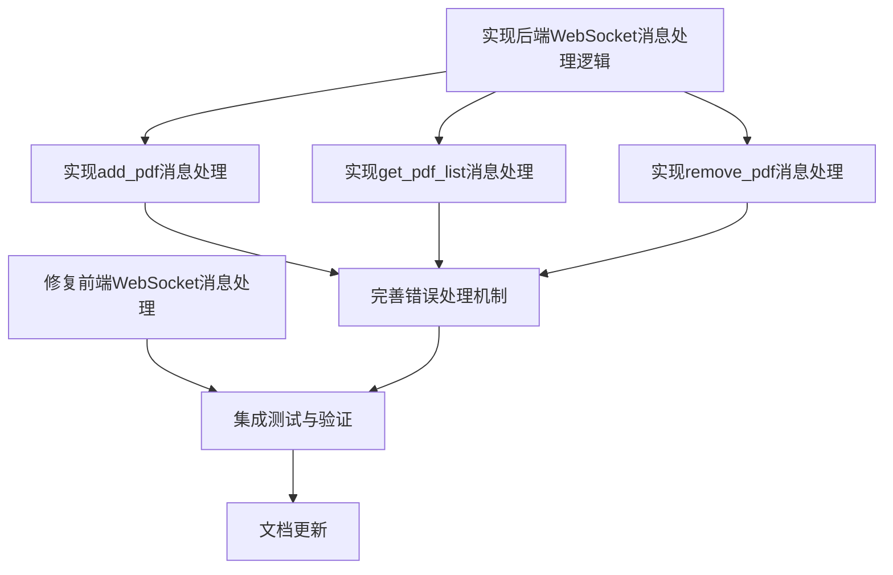

# Anki LinkMaster PDFJS - task2-homepageDev 任务依赖文档

## 1. 任务列表

| 任务ID | 任务名称 | 任务描述 | 负责人 | 预计工时 |
|-------|---------|---------|-------|--------|
| T2-001 | 修复前端WebSocket消息处理 | 修复main.js中的removePDF方法递归调用问题，确保handleFileSelect方法正确处理浏览器环境下的文件路径 | 前端开发 | 2小时 |
| T2-002 | 实现后端WebSocket消息处理逻辑 | 在application.py中连接websocket_server.message_received信号，实现消息处理函数 | 后端开发 | 3小时 |
| T2-003 | 实现add_pdf消息处理 | 实现handle_add_pdf方法，处理前端发送的添加PDF文件请求 | 后端开发 | 2小时 |
| T2-004 | 实现get_pdf_list消息处理 | 实现handle_get_pdf_list方法，处理前端发送的获取PDF列表请求 | 后端开发 | 2小时 |
| T2-005 | 实现remove_pdf消息处理 | 实现handle_remove_pdf方法，处理前端发送的删除PDF文件请求 | 后端开发 | 2小时 |
| T2-006 | 完善错误处理机制 | 实现统一的错误处理机制，确保前后端能够正确处理各类异常情况 | 全栈开发 | 3小时 |
| T2-007 | 集成测试与验证 | 对修复的功能进行全面测试，确保所有功能都能按照预期工作 | 测试人员 | 2小时 |
| T2-008 | 文档更新 | 更新相关文档，确保文档与代码实现一致 | 文档人员 | 1小时 |

## 2. 任务依赖关系

### 依赖关系说明

1. **直接依赖**：
   - T2-001（修复前端WebSocket消息处理）是独立任务，完成后可以直接进行集成测试
   - T2-002（实现后端WebSocket消息处理逻辑）是后端开发的基础任务，完成后才能开始实现具体的消息处理功能
   - T2-003、T2-004、T2-005（实现具体消息处理）依赖于T2-002的完成
   - T2-006（完善错误处理机制）依赖于T2-003、T2-004、T2-005的完成
   - T2-007（集成测试与验证）依赖于T2-001和T2-006的完成
   - T2-008（文档更新）依赖于T2-007的完成

2. **并行任务**：
   - T2-001（修复前端WebSocket消息处理）和T2-002（实现后端WebSocket消息处理逻辑）可以并行进行
   - T2-003、T2-004、T2-005（实现具体消息处理）可以并行进行

3. **串行任务**：
   - T2-002 → T2-003/T2-004/T2-005 → T2-006 → T2-007 → T2-008 必须串行进行

## 3. 任务关联的代码文件

### T2-001：修复前端WebSocket消息处理

| 代码文件 | 文件路径 | 功能描述 |
|---------|---------|---------|
| main.js | src/frontend/pdf-home/main.js | PDF主页的前端逻辑，包含WebSocket连接管理、事件监听、文件选择处理、PDF列表管理及渲染等核心功能 |

### T2-002：实现后端WebSocket消息处理逻辑

| 代码文件 | 文件路径 | 功能描述 |
|---------|---------|---------|
| application.py | src/backend/app/application.py | AnkiLinkMasterApp主应用类，包含PDF管理器和WebSocket服务器初始化、主窗口创建及应用生命周期管理等 |

### T2-003：实现add_pdf消息处理

| 代码文件 | 文件路径 | 功能描述 |
|---------|---------|---------|
| application.py | src/backend/app/application.py | AnkiLinkMasterApp主应用类，负责处理WebSocket消息 |
| manager.py | src/backend/pdf_manager/manager.py | PDFManager类，负责PDF文件的添加、删除和列表管理 |

### T2-004：实现get_pdf_list消息处理

| 代码文件 | 文件路径 | 功能描述 |
|---------|---------|---------|
| application.py | src/backend/app/application.py | AnkiLinkMasterApp主应用类，负责处理WebSocket消息 |
| manager.py | src/backend/pdf_manager/manager.py | PDFManager类，负责PDF文件的添加、删除和列表管理 |

### T2-005：实现remove_pdf消息处理

| 代码文件 | 文件路径 | 功能描述 |
|---------|---------|---------|
| application.py | src/backend/app/application.py | AnkiLinkMasterApp主应用类，负责处理WebSocket消息 |
| manager.py | src/backend/pdf_manager/manager.py | PDFManager类，负责PDF文件的添加、删除和列表管理 |

### T2-006：完善错误处理机制

| 代码文件 | 文件路径 | 功能描述 |
|---------|---------|---------|
| application.py | src/backend/app/application.py | AnkiLinkMasterApp主应用类，负责处理WebSocket消息和错误处理 |
| manager.py | src/backend/pdf_manager/manager.py | PDFManager类，负责PDF文件的添加、删除和列表管理及错误处理 |
| server.py | src/backend/websocket/server.py | WebSocketServer类，负责处理前端与后端的实时通信及错误处理 |
| main.js | src/frontend/pdf-home/main.js | PDF主页的前端逻辑，包含WebSocket错误处理 |

### T2-007：集成测试与验证

| 代码文件 | 文件路径 | 功能描述 |
|---------|---------|---------|
| test_integration.py | src/backend/tests/test_integration.py | 集成测试代码，验证PDF管理器与WebSocket服务器之间的集成功能 |
| test_pdf_manager.py | src/backend/tests/test_pdf_manager.py | PDFManager单元测试代码 |
| test_websocket_server.py | src/backend/tests/test_websocket_server.py | WebSocketServer单元测试代码 |

### T2-008：文档更新

| 代码文件 | 文件路径 | 功能描述 |
|---------|---------|---------|
| README.md | README.md | 项目说明文档 |
| step1_CONSENSUS_task2-homepageDev.md | docs/task2-homepageDev/step1_CONSENSUS_task2-homepageDev.md | 需求共识确认文档 |
| step2_DESIGN_task2-homepageDev.md | docs/task2-homepageDev/step2_DESIGN_task2-homepageDev.md | 架构设计文档 |
| step3_TASK_DEPENDENCY_task2-homepageDev.md | docs/task2-homepageDev/step3_TASK_DEPENDENCY_task2-homepageDev.md | 任务依赖文档 |

## 4. 关键路径分析

### 关键路径

T2-002 → T2-003/T2-004/T2-005 → T2-006 → T2-007 → T2-008

### 关键任务说明

1. **T2-002（实现后端WebSocket消息处理逻辑）**：
   - 这是后端开发的基础任务，必须优先完成
   - 如果此任务延期，将影响所有后续的后端开发任务

2. **T2-006（完善错误处理机制）**：
   - 此任务需要等待所有具体的消息处理功能实现后才能开始
   - 是连接开发和测试的关键任务

3. **T2-007（集成测试与验证）**：
   - 此任务需要等待前端和后端的所有开发任务完成后才能开始
   - 是验证整个功能是否正常工作的关键任务

通过关键路径分析，我们可以清楚地了解整个开发流程中的关键环节，合理安排开发资源，确保项目能够按时完成。