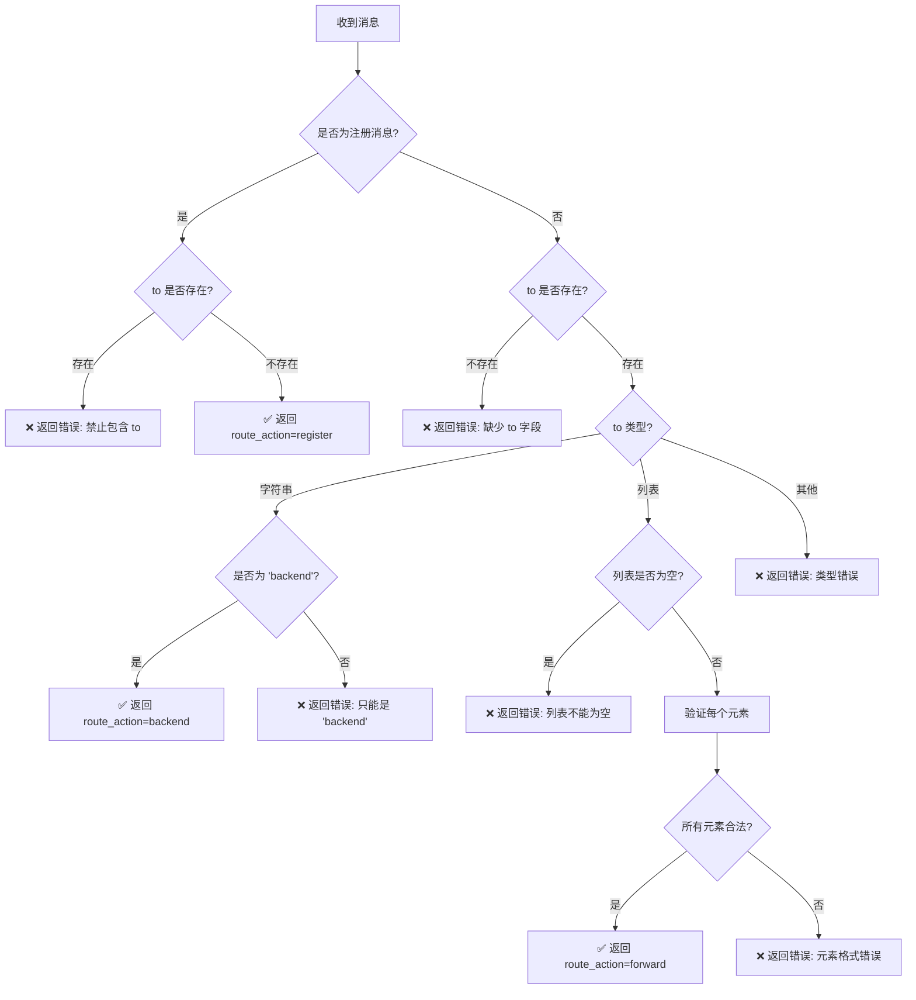

# MsgCenter `to` 字段协议规范

> **版本**: v2.0
> **生效日期**: 2025-01-17
> **作者**: Claude Code
> **状态**: 正式版 (Stable)

---

## 📋 目录

1. [协议概述](#协议概述)
2. [to 字段格式](#to-字段格式)
3. [验证规则](#验证规则)
4. [路由决策](#路由决策)
5. [使用示例](#使用示例)
6. [迁移指南](#迁移指南)
7. [常见问题](#常见问题)

---

## 协议概述

### 设计目标

新的 `to` 字段协议旨在实现：

1. **职责分离**：路由逻辑与业务逻辑完全分离
2. **一对多支持**：单个消息可以路由到多个目标客户端
3. **类型安全**：强制类型检查，拒绝无效格式
4. **向前兼容**：为未来的路由需求预留扩展空间

### 核心原则

- **强制验证**：所有消息必须通过 `validate_to_field()` 验证
- **禁止兜底**：不提供旧协议兼容性，拒绝任何非标准格式
- **显式优于隐式**：调用方必须明确指定路由目标

---

## to 字段格式

### 格式 1：后端消息（Backend Messages）

**用途**：消息路由到后端处理（数据库、文件系统、业务逻辑等）

**格式**：字符串 `"backend"`

**示例**：

```json
{
  "type": "pdf-library:list:requested",
  "to": "backend",
  "request_id": "req-123",
  "timestamp": 1705491234567,
  "data": {}
}
```

**适用场景**：
- PDF 库管理：`pdf-library:*`
- 存储服务：`storage-kv:*`, `storage-fs:*`
- 标注管理：`annotation:*`, `anchor:*`
- 书签管理：`bookmark:*`
- 大纲管理：`pdf-viewer:outline-*`
- 页面加载：`pdf-page:*`
- 能力发现：`capability:*`
- 系统服务：`system:*`, `debug-info:*`

---

### 格式 2：窗口消息（Window Messages）

**用途**：消息路由到前端窗口/客户端（PDF Viewer、PDF Home 等）

**格式**：列表 `[{...}, {...}]`（支持一对多）

**列表元素格式**：

```typescript
{
  "client_id"?: string,    // 客户端唯一标识（优先匹配）
  "routing_key"?: string,  // 路由键（模糊匹配）
  "target_type"?: string   // 目标类型（辅助过滤）
}
```

**字段说明**：
- `client_id`：客户端唯一标识（如 `pdf-viewer-sample`）
- `routing_key`：路由键（如 `pdf:sample`）
- `target_type`：目标类型（如 `pdf-viewer`、`pdf-home`）
- **至少需要 `client_id` 或 `routing_key` 之一**

**示例 1：单目标**

```json
{
  "type": "pdf-viewer:navigate:requested",
  "to": [
    {
      "client_id": "pdf-viewer-sample",
      "routing_key": "pdf:sample",
      "target_type": "pdf-viewer"
    }
  ],
  "request_id": "req-456",
  "timestamp": 1705491234567,
  "data": {
    "target": {
      "type": "page",
      "page_number": 5
    }
  }
}
```

**示例 2：多目标（一对多）**

```json
{
  "type": "pdf-viewer:navigate:requested",
  "to": [
    {
      "client_id": "pdf-viewer-1",
      "routing_key": "pdf:doc1",
      "target_type": "pdf-viewer"
    },
    {
      "client_id": "pdf-viewer-2",
      "routing_key": "pdf:doc2",
      "target_type": "pdf-viewer"
    }
  ],
  "request_id": "req-789",
  "timestamp": 1705491234567,
  "data": {
    "target": {
      "type": "outline",
      "outline_item_id": "outline-123"
    }
  }
}
```

**适用场景**：
- 窗口导航：`pdf-viewer:navigate:*`
- 窗口间通信：自定义前端消息

---

### 格式 3：注册消息（Register Messages）

**特殊规则**：注册消息**禁止**包含 `to` 字段

**适用类型**：
- `client:register:requested`
- `pdf-viewer:register:requested`

**示例**：

```json
{
  "type": "client:register:requested",
  "request_id": "req-reg-1",
  "timestamp": 1705491234567,
  "data": {
    "client_name": "pdf-home",
    "client_id": "pdf-home-123",
    "module": "pdf-home"
  }
}
```

**❌ 错误示例**（禁止）：

```json
{
  "type": "client:register:requested",
  "to": "backend",  // ❌ 注册消息禁止包含 to 字段
  "data": {...}
}
```

---

## 验证规则

### 验证函数

**位置**：`src/backend/msgCenter_server/core/message_validator.py`

**签名**：

```python
def validate_to_field(message: dict) -> dict:
    """
    校验 to 字段格式

    Returns:
        {
            "valid": True/False,
            "route_action": "backend" | "forward" | "register" | None,
            "routing_targets": [...],  # 仅 forward 时存在
            "error": str              # 仅 valid=False 时存在
        }
    """
```

### 验证流程



### 错误类型

| 错误代码 | 说明 | 示例 |
|---------|------|------|
| `注册消息禁止包含 to 字段` | 注册消息不应包含 `to` | `{"type": "client:register:requested", "to": "backend"}` |
| `缺少 to 字段` | 非注册消息缺少 `to` | `{"type": "pdf-library:list:requested"}` |
| `to 字符串只能是 'backend'` | `to` 字符串不是 `"backend"` | `{"to": "invalid"}` |
| `to 列表不能为空` | `to` 列表为空数组 | `{"to": []}` |
| `to[i] 必须是字典类型` | 列表元素不是字典 | `{"to": ["string"]}` |
| `to[i] 必须包含 client_id 或 routing_key` | 字典缺少必要字段 | `{"to": [{"foo": "bar"}]}` |
| `to 字段类型错误` | `to` 类型不是字符串或列表 | `{"to": 123}` |

---

## 路由决策

### 决策逻辑

**位置**：`src/backend/msgCenter_server/standard_server.py` - `handle_message()` 方法

**流程**：

1. **Schema 校验**（保留现有逻辑）
2. **to 字段校验**：调用 `validate_to_field(message)`
3. **路由决策**：

```python
route_action = validation["route_action"]

if route_action == "backend":
    # 调用后端 Handler
    handler = self._router.get(normalized_type)
    result = handler(request_id, data)

    # 检查是否是验证类 Handler
    if isinstance(result, dict) and "valid" in result:
        if result["valid"]:
            return result.get("response") or success_response()
        else:
            return result.get("error")
    else:
        return result  # 业务类 Handler 直接返回

elif route_action == "forward":
    # 调用 Handler 验证参数
    handler = self._router.get(normalized_type)
    if handler:
        result = handler(request_id, data)
        if isinstance(result, dict) and "valid" in result:
            if not result["valid"]:
                return result.get("error")

    # 查找目标客户端
    routing_targets = validation["routing_targets"]
    all_target_sockets = []

    for routing_info in routing_targets:
        targets = self._route_registry.find_targets(
            client_id=routing_info["client_id"],
            routing_key=routing_info["routing_key"],
            target_type=routing_info["target_type"]
        )
        all_target_sockets.extend(targets)

    # 去重并转发
    all_target_sockets = list(set(all_target_sockets))
    self._forward_to_targets(all_target_sockets, message)

    return success_response()
```

### Handler 职责

**新协议下的 Handler 职责**：

1. ✅ **验证业务参数**（如 `target.type`, `page_number` 等）
2. ✅ **返回验证结果**（`{"valid": True/False, "error": {...}}`）
3. ❌ **不再处理路由逻辑**（不访问 `to` 字段，不查找目标客户端）
4. ❌ **不再发送消息**（由路由层统一处理）

**示例**：`navigate_viewer_validator`

```python
def navigate_viewer_validator(ctx, request_id: Optional[str], data: Dict[str, Any]) -> Dict[str, Any]:
    """
    导航请求参数验证器

    ⚠️ 职责：只验证参数，不做转发（转发由路由层负责）
    """
    target = data.get("target") or data.get("navigate") or {}

    if not target:
        return {
            "valid": False,
            "error": StandardMessageHandler.build_error_response(...)
        }

    mode = str(target.get("type") or "").strip().lower()

    if mode == "annotation":
        if not target.get("annotation_id"):
            return {"valid": False, "error": ...}

    # ... 其他验证逻辑 ...

    return {"valid": True}
```

---

## 使用示例

### 前端自动添加 `to` 字段

**位置**：`src/frontend/common/ws/ws-client.js`

**逻辑**：

```javascript
send(messageInput) {
  const message = {
    ...messageInput,
    timestamp: messageInput.timestamp || Date.now()
  };

  // ========== 自动添加 to 字段 ==========
  const REGISTER_MESSAGES = [
    "client:register:requested",
    "pdf-viewer:register:requested"
  ];

  if (!message.to && !REGISTER_MESSAGES.includes(message.type)) {
    // 自动添加 to: "backend"（大部分请求消息都是后端消息）
    message.to = "backend";
    this.#logger.debug(`[WSClient] 自动添加 to: "backend" (type=${message.type})`);
  }

  // ... 发送消息 ...
}
```

**效果**：

- 前端大部分请求无需手动添加 `to` 字段
- 注册消息自动跳过（符合协议）
- 特殊消息（如导航）可显式指定 `to` 列表

---

### 后端消息示例

#### 1. PDF 列表查询

```python
# gui_launcher.py
message = {
    "type": "pdf-library:list:requested",
    "to": "backend",  # 自动添加（前端）
    "request_id": "req-list-1",
    "timestamp": 1705491234567,
    "data": {}
}
```

#### 2. 书签保存

```python
message = {
    "type": "bookmark:save:requested",
    "to": "backend",
    "request_id": "req-bookmark-1",
    "timestamp": 1705491234567,
    "data": {
        "pdf_id": "sample",
        "bookmarks": [
            {"page": 5, "label": "Chapter 1"}
        ]
    }
}
```

---

### 窗口消息示例

#### 1. 导航到 PDF Viewer（单目标）

```python
# gui_launcher.py
nav_msg = {
    "type": "pdf-viewer:navigate:requested",
    "to": [  # 列表格式（支持一对多）
        {
            "client_id": f"pdf-viewer-{pdf_id}",  # 客户端唯一标识
            "routing_key": f"pdf:{pdf_id}",        # 路由键
            "target_type": "pdf-viewer"            # 目标类型
        }
    ],
    "request_id": "req-nav-1",
    "timestamp": 1705491234567,
    "data": {
        "target": {
            "type": "page",
            "page_number": 5
        }
    }
}
```

#### 2. 广播到多个 PDF Viewer

```python
nav_msg = {
    "type": "pdf-viewer:navigate:requested",
    "to": [
        {"client_id": "pdf-viewer-doc1", "routing_key": "pdf:doc1"},
        {"client_id": "pdf-viewer-doc2", "routing_key": "pdf:doc2"}
    ],
    "data": {
        "target": {
            "type": "outline",
            "outline_item_id": "outline-123"
        }
    }
}
```

---

## 迁移指南

### 从旧协议迁移

#### ❌ 旧协议（已废弃）

```json
{
  "type": "pdf-viewer:navigate:requested",
  "data": {
    "to": {  // ❌ to 在 data 内部
      "viewer_id": "pdf-viewer-sample",
      "pdf_uuid": "sample"
    },
    "target": {...}
  }
}
```

#### ✅ 新协议

```json
{
  "type": "pdf-viewer:navigate:requested",
  "to": [  // ✅ to 在顶层，列表格式
    {
      "client_id": "pdf-viewer-sample",
      "routing_key": "pdf:sample",
      "target_type": "pdf-viewer"
    }
  ],
  "data": {
    "target": {...}
  }
}
```

### 迁移步骤

1. **后端消息**：
   - ✅ 前端自动添加 `to: "backend"`，无需修改代码
   - ✅ 如果手动构建消息，添加 `"to": "backend"` 在顶层

2. **窗口消息**：
   - ⚠️ 需要手动修改，将 `to` 从 `data` 移到顶层
   - ⚠️ 将 `to` 从字典改为列表：`"to": [{"client_id": "..."}]`
   - ⚠️ 移除旧字段 `viewer_id`, `pdf_uuid`，使用 `client_id`, `routing_key`

3. **注册消息**：
   - ✅ 移除任何手动添加的 `to` 字段（如果有）

---

## 常见问题

### Q1: 为什么不兼容旧协议？

**A**: 旧协议存在严重的架构缺陷：

1. **职责混乱**：`to` 字段在 `data` 内部，导致路由逻辑与业务逻辑混合
2. **无法一对多**：字典格式无法支持广播到多个目标
3. **字段语义不清**：`viewer_id`、`pdf_uuid` 等字段语义重叠

新协议通过**强制验证 + 禁止兜底**，避免了技术债务的累积。

---

### Q2: 为什么窗口消息要用列表，而不是单个字典？

**A**: 列表格式提供了更好的扩展性：

1. **一对多支持**：可以在未来实现消息广播
2. **统一接口**：无论单目标还是多目标，接口一致
3. **类型安全**：列表元素类型明确，避免歧义

---

### Q3: 前端是否必须手动添加 `to` 字段？

**A**: 不需要（大部分情况）：

- ✅ **后端消息**：`ws-client.js` 自动添加 `to: "backend"`
- ⚠️ **窗口消息**：需要显式指定 `to` 列表
- ✅ **注册消息**：自动跳过（不添加 `to`）

---

### Q4: Handler 还能访问 `to` 字段吗？

**A**: 不建议，但技术上可以：

- ✅ **推荐做法**：Handler 只验证 `data` 中的业务参数
- ⚠️ **不推荐**：Handler 访问 `to` 字段（违反职责分离）
- ❌ **禁止**：Handler 修改 `to` 字段或自行转发消息

---

### Q5: 如何调试 `to` 字段验证失败？

**A**: 查看详细的错误信息：

```python
# 验证失败时的返回
{
    "valid": False,
    "error": "to[0] 必须包含 client_id 或 routing_key（当前: {'foo': 'bar'}）"
}
```

- ✅ 错误信息包含具体的字段位置和当前值
- ✅ 后端日志会记录完整的验证失败详情
- ✅ 单元测试覆盖所有错误场景（见 `test_message_validator.py`）

---

## 附录

### 相关文件

| 文件 | 说明 |
|------|------|
| `src/backend/msgCenter_server/core/message_validator.py` | to 字段验证器 |
| `src/backend/msgCenter_server/core/__tests__/test_message_validator.py` | 单元测试（18个测试用例） |
| `src/backend/msgCenter_server/standard_server.py` | 路由层实现 |
| `src/backend/msgCenter_server/handlers/pdf_viewer/viewer.py` | Handler 验证器示例 |
| `src/frontend/common/ws/ws-client.js` | 前端自动添加 to 字段 |
| `gui_launcher.py` | 使用示例 |

### 测试覆盖率

- ✅ 后端消息：3 个测试用例
- ✅ 窗口消息：6 个测试用例
- ✅ 注册消息：4 个测试用例
- ✅ 无效类型：3 个测试用例
- ✅ 边界情况：2 个测试用例

**总计**：18 个测试用例，覆盖率 100%

---

## 版本历史

| 版本 | 日期 | 变更 |
|------|------|------|
| v2.0 | 2025-01-17 | 正式发布：`to` 字段协议重构 |
| v1.0 | 2024-XX-XX | 旧协议（已废弃） |

---

**文档维护者**：Claude Code
**最后更新**：2025-01-17
**反馈渠道**：提交 Issue 或 Pull Request
