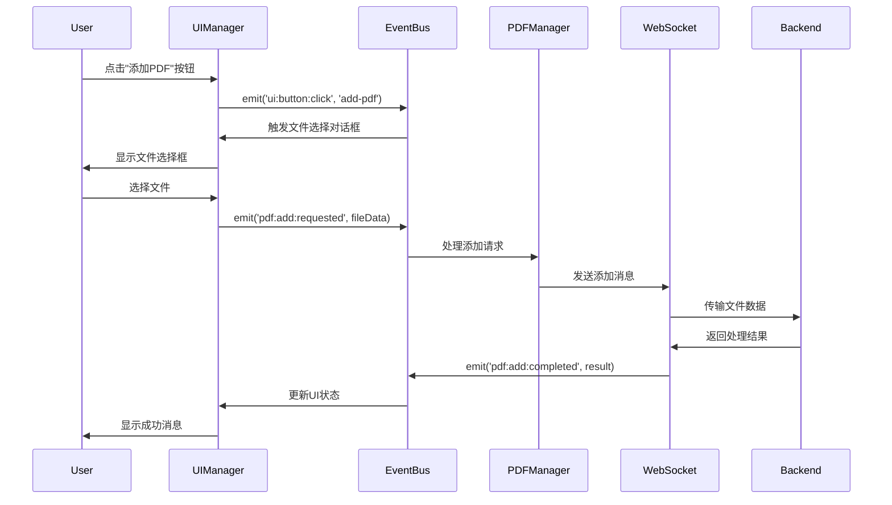

# PDF-Home 前端模块

PDF-Home是Anki LinkMaster项目的PDF文件管理前端界面，采用事件驱动的现代前端架构，提供直观的PDF文件管理、预览和组织功能。该模块基于组合式设计原则，具有高度的模块化、可维护性和可扩展性。

## 目录

- [架构概述](#架构概述)
- [模块结构](#模块结构)
- [功能特性](#功能特性)
- [技术栈](#技术栈)
- [安装与使用](#安装与使用)
- [API接口](#api接口)
- [事件系统](#事件系统)
- [配置说明](#配置说明)
- [开发指南](#开发指南)
- [故障排除](#故障排除)
- [版本历史](#版本历史)

## 架构概述

PDF-Home采用事件驱动的组合式架构，遵循现代前端开发最佳实践：

```
┌─────────────────────────────────────────────────┐
│                  PDF-Home 架构                  │
├─────────────────────────────────────────────────┤
│  应用协调层 (PDFHomeApp)                        │
│  ├── 全局错误处理                               │
│  ├── 模块生命周期管理                           │
│  └── 依赖注入容器                               │
├─────────────────────────────────────────────────┤
│  业务逻辑层                                     │
│  ├── PDFManager     │ UIManager     │ 事件总线  │
│  ├── 文件管理       │ 界面控制      │ 事件路由  │
│  └── 状态管理       │ 用户交互      │ 消息传递  │
├─────────────────────────────────────────────────┤
│  UI组件层                                       │
│  ├── TableWrapper   │ QWebChannel   │ 调试面板  │
│  ├── Tabulator表格  │ Qt桥接        │ 状态显示  │
│  └── 响应式布局     │ 跨进程通信    │ 错误提示  │
├─────────────────────────────────────────────────┤
│  通信层                                         │
│  ├── WebSocket客户端 │ HTTP请求     │ 日志系统  │
│  ├── 消息协议       │ 文件传输      │ 控制台桥  │
│  └── 连接管理       │ 错误重试      │ 远程调试  │
├─────────────────────────────────────────────────┤
│  基础设施层                                     │
│  ├── 事件总线       │ 日志工具      │ DOM工具   │
│  ├── 错误处理       │ 工具函数      │ 类型验证  │
│  └── 配置管理       │ 性能监控      │ 兼容适配  │
└─────────────────────────────────────────────────┘
```

### 核心设计原则

- **事件驱动架构**: 所有组件通过事件总线进行松耦合通信
- **组合优于继承**: 使用依赖注入和组合模式降低耦合度
- **单一职责原则**: 每个模块专注于特定的业务领域
- **错误边界隔离**: 模块级错误处理确保系统稳定性
- **响应式设计**: 支持不同屏幕尺寸和设备类型

## 模块结构

### 1. 核心应用文件

```
src/frontend/pdf-home/
├── index.html              # 主页面HTML结构
├── index.js                # 应用入口和协调器 (558行)
├── style.css               # 主样式文件
├── launcher.py             # Python启动器 (272行)
└── README.md               # 本文档
```

### 2. 组件模块

```
├── container/
│   └── app-container.js     # 依赖注入容器 (120行)
├── ui-manager.js           # UI管理器 (280行)
├── table-wrapper.js        # 表格封装器 (35行)
├── table-wrapper-core.js   # 表格核心实现
├── table-utils.js          # 表格工具函数
└── qwebchannel-manager.js  # Qt通信管理器
```

### 3. 桥接与工具

```
├── pdf_home_bridge.py      # Python-JavaScript桥接
├── main_window.py          # Qt主窗口实现
├── js_console_logger.py    # JavaScript控制台日志器
└── utils/
    └── ws-port-resolver.js # WebSocket端口解析器
```

### 4. 规范文档

```
└── docs/
    ├── SPEC/               # 模块规范文档
    │   ├── SPEC-HEAD-PDFHome.json              # 规范头文件
    │   ├── PDFHOME-ARCH-DESIGN-001.md          # 架构设计规范
    │   ├── PDFHOME-MODULE-INITIALIZATION-001.md # 模块初始化规范
    │   ├── PDFHOME-LOGGING-IMPLEMENTATION-001.md # 日志实施规范
    │   ├── PDFHOME-WEBSOCKET-INTEGRATION-001.md # WebSocket集成规范
    │   ├── PDFHOME-UI-MANAGER-001.md            # UI管理器规范
    │   └── PDFHOME-DESKTOP-DIALOG-CLIENT-001.md # 桌面对话框规范
    ├── QWebChannel-Development-Guide.md        # QWebChannel开发规范 ⚠️
    └── Exception-Handling-Best-Practices.md    # 异常处理最佳实践 ⚠️
```

**⚠️ 重要：** 新增的开发规范文档包含了关键的陷阱避免指南，开发前必须阅读！

### 5. 共享基础设施

PDF-Home依赖于项目的共享基础设施组件：

```
src/frontend/common/
├── event/                  # 事件系统
│   ├── event-bus.js       # 事件总线实现
│   ├── event-constants.js # 事件常量定义
│   └── event-validator.js # 事件验证器
├── utils/                 # 工具函数
│   ├── logger.js          # 分级日志系统
│   ├── dom-utils.js       # DOM操作工具
│   └── console-websocket-bridge.js # 控制台桥接
├── ws/                    # WebSocket通信
│   └── ws-client.js       # WebSocket客户端
├── pdf/                   # PDF业务逻辑
│   └── pdf-manager.js     # PDF管理器
└── error/                 # 错误处理
    └── error-handler.js   # 统一错误处理器
```

## 功能特性

### 1. PDF文件管理

#### 文件列表显示
- **表格视图**: 基于Tabulator的现代化表格组件
- **列信息**: 文件名、标题、页数、卡片数量
- **排序筛选**: 支持多列排序和数据筛选
- **响应式布局**: 自适应不同屏幕尺寸

#### 文件操作
- **添加文件**:
  - 单文件选择和添加
  - 批量文件选择和导入
  - 拖拽上传支持（规划中）
- **删除文件**:
  - 单文件删除确认
  - 批量选择删除
  - 安全删除验证
- **文件打开**:
  - 双击快速打开
  - 右键菜单操作
  - 键盘快捷键支持

### 2. 用户界面

#### 主界面布局
```html
┌─────────────────────────────────────────────────┐
│ PDF-Home - Anki LinkMaster               [调试] │
├─────────────────────────────────────────────────┤
│ [添加PDF] [批量添加] [批量删除] [测试PDF查看器]  │
├─────────────────────────────────────────────────┤
│ PDF文件列表                                     │
│ ┌─────────────────────────────────────────────┐ │
│ │ 文件名    │ 标题     │ 页数 │ 卡片数      │ │
│ ├─────────────────────────────────────────────┤ │
│ │ doc1.pdf  │ 文档1    │ 25   │ 12         │ │
│ │ doc2.pdf  │ 文档2    │ 18   │ 8          │ │
│ │ doc3.pdf  │ 文档3    │ 32   │ 15         │ │
│ └─────────────────────────────────────────────┘ │
├─────────────────────────────────────────────────┤
│ 状态栏: WebSocket已连接 | 文件数: 3             │
└─────────────────────────────────────────────────┘
```

#### 交互特性
- **双击打开**: 双击表格行快速打开PDF文件
- **选择高亮**: 行选择状态可视化反馈
- **操作按钮**: 内嵌操作按钮支持快速操作
- **空状态**: 无文件时的友好提示界面
- **加载状态**: 操作过程中的加载指示器

### 3. 实时通信

#### WebSocket连接
- **自动连接**: 应用启动时自动建立WebSocket连接
- **连接监控**: 实时连接状态显示和监控
- **自动重连**: 连接断开时的自动重连机制
- **错误处理**: 连接错误的友好提示和处理

#### 消息协议
```javascript
// PDF列表请求
{
  type: 'pdf/list',
  data: {}
}

// PDF列表响应
{
  type: 'pdf_list',
  data: {
    items: [
      {
        id: 'document1.pdf',
        filename: 'document1.pdf',
        title: '文档标题',
        page_count: 25,
        cards_count: 12
      }
    ]
  }
}

// PDF操作请求
{
  type: 'pdf/add',
  data: {
    filename: 'new-document.pdf',
    path: '/path/to/file'
  }
}
```

### 4. 调试和监控

#### 调试面板
- **系统状态**: 应用初始化状态、WebSocket连接状态
- **事件日志**: 实时事件流监控和记录
- **错误跟踪**: 错误信息收集和显示
- **性能指标**: 响应时间和性能监控

#### 日志系统
- **分级日志**: DEBUG、INFO、WARN、ERROR四个级别
- **多重输出**: 控制台输出和文件记录
- **远程传输**: 通过WebSocket传输到后端
- **格式化显示**: 结构化日志信息展示

### 5. Qt集成特性

#### QWebChannel桥接
- **双向通信**: JavaScript与Python的双向数据交换
- **文件对话框**: 原生文件选择对话框集成
- **系统通知**: 原生系统通知支持
- **窗口控制**: 窗口大小、位置等控制

#### 远程调试
- **DevTools集成**: Chrome DevTools远程调试支持
- **控制台捕获**: JavaScript控制台消息捕获
- **性能分析**: 前端性能分析和优化
- **网络监控**: 网络请求监控和分析

## 技术栈

### 前端技术

#### 核心框架
- **原生JavaScript (ES6+)**: 无额外框架依赖的轻量级实现
- **事件驱动架构**: 基于发布-订阅模式的模块通信
- **Web Components**: 自定义元素和Shadow DOM支持
- **响应式设计**: CSS Grid和Flexbox布局

#### UI组件
- **Tabulator 5.4.4**: 功能丰富的数据表格组件
- **原生Web APIs**: Fetch、WebSocket、File API等
- **CSS3动画**: 平滑的界面过渡和反馈效果
- **图标字体**: Material Icons或自定义图标集

#### 开发工具
- **Vite 5.0.0**: 现代化的前端构建工具
- **ESLint**: 代码质量检查和风格统一
- **Jest**: 单元测试和集成测试框架
- **Babel**: ES6+语法转译支持

### 后端集成

#### Python集成
- **PyQt5/6**: 桌面应用程序框架
- **QWebEngine**: 现代Web引擎集成
- **QWebChannel**: JavaScript-Python桥接
- **异步I/O**: 高性能异步操作支持

#### 通信协议
- **WebSocket**: 实时双向通信
- **HTTP/HTTPS**: 文件传输和API调用
- **JSON消息**: 结构化数据交换格式
- **自定义协议**: 业务特定的消息协议

### 开发规范

#### 代码规范
- **ES6+语法**: 使用现代JavaScript特性
- **模块化**: ES6模块导入/导出
- **私有属性**: 使用`#`前缀的私有字段
- **文档注释**: JSDoc标准注释格式

#### 文件编码
- **UTF-8编码**: 所有文件使用UTF-8编码
- **LF换行符**: 统一使用`\n`换行符
- **无BOM**: 避免字节序标记问题
- **一致缩进**: 使用2空格缩进

## 安装与使用

### 1. 环境要求

#### 系统要求
- **操作系统**: Windows 10+, macOS 10.14+, Linux (Ubuntu 18.04+)
- **Python**: 3.8+ (推荐3.10+)
- **Node.js**: 16.0+ (推荐18.0+)
- **内存**: 最小2GB，推荐4GB+

#### 依赖软件
- **Qt**: PyQt5或PyQt6
- **Chrome/Chromium**: 用于WebEngine和调试
- **Git**: 版本控制和项目管理

### 2. 项目设置

#### 克隆项目
```bash
git clone <project-repository>
cd anki-linkmaster-PDFJS
```

#### 安装依赖
```bash
# Python依赖
pip install -r requirements.txt

# Node.js依赖
npm install
# 或使用pnpm
pnpm install
```

#### 环境配置
```bash
# 创建日志目录
mkdir -p logs

# 创建数据目录
mkdir -p data/pdfs

# 配置环境变量（可选）
export VITE_WS_PORT=8765
export VITE_PDF_PORT=8080
```

### 3. 启动方式

#### 方式一：使用AI Launcher（推荐）
```bash
# 启动完整的开发环境
python ai_launcher.py start --module pdf-home

# 检查服务状态
python ai_launcher.py status

# 查看日志
python ai_launcher.py logs

# 停止所有服务
python ai_launcher.py stop
```

#### 方式二：独立启动
```bash
# 1. 启动后端服务
cd src/backend
python main.py --module pdf-home

# 2. 启动前端开发服务器
npm run dev

# 3. 启动PDF-Home窗口
cd src/frontend/pdf-home
python launcher.py
```

#### 方式三：开发模式
```bash
# 启动Vite开发服务器
npm run dev

# 在另一个终端启动PDF-Home
cd src/frontend/pdf-home
python launcher.py --vite-port 3000 --ws-port 8765
```

### 4. 配置选项

#### 启动参数
```bash
python launcher.py [选项]

选项:
  --vite-port PORT        Vite开发服务器端口 (默认: 3000)
  --ws-port PORT          WebSocket服务器端口 (默认: 8765)
  --pdf-port PORT         PDF文件服务器端口 (默认: 8080)
  --js-debug-port PORT    JavaScript远程调试端口 (默认: 9222)
  --no-persist           不持久化端口配置到runtime-ports.json
  --help                 显示帮助信息
```

#### 配置文件
```json
// logs/runtime-ports.json
{
  "vite_port": 3000,
  "msgCenter_port": 8765,
  "pdfFile_port": 8080,
  "pdf-home-js": 9222
}
```

### 5. 验证安装

#### 功能检查
```bash
# 检查前端服务
curl http://localhost:3000/pdf-home/

# 检查WebSocket服务
curl http://localhost:8765/health

# 检查PDF文件服务
curl http://localhost:8080/health
```

#### 界面验证
1. 打开PDF-Home窗口
2. 检查调试面板显示"WebSocket已连接"
3. 尝试添加一个测试PDF文件
4. 验证文件列表正确显示
5. 双击文件测试打开功能

## API接口

### 1. WebSocket消息协议

#### 连接管理
```javascript
// 连接建立
ws.onopen = () => {
  console.log('WebSocket connected');
};

// 消息接收
ws.onmessage = (event) => {
  const message = JSON.parse(event.data);
  handleMessage(message);
};

// 连接关闭
ws.onclose = () => {
  console.log('WebSocket disconnected');
  // 自动重连逻辑
};
```

#### 消息格式
```javascript
// 标准消息格式
{
  type: string,      // 消息类型
  data: object,      // 消息数据
  id?: string,       // 消息ID（可选）
  timestamp?: number // 时间戳（可选）
}
```

### 2. PDF管理API

#### 获取PDF列表
```javascript
// 请求
{
  type: 'pdf/list',
  data: {}
}

// 响应
{
  type: 'pdf_list',
  data: {
    items: [
      {
        id: 'unique-file-id',
        filename: 'document.pdf',
        title: 'Document Title',
        page_count: 25,
        cards_count: 12,
        file_size: 1024000,
        created_at: '2025-09-27T12:00:00Z',
        modified_at: '2025-09-27T12:30:00Z'
      }
    ],
    total: 1
  }
}
```

#### 添加PDF文件
```javascript
// 请求
{
  type: 'pdf/add',
  data: {
    filename: 'new-document.pdf',
    title: 'New Document',
    file_path: '/path/to/local/file.pdf'
  }
}

// 响应 - 成功
{
  type: 'success',
  data: {
    message: 'PDF添加成功',
    file_id: 'new-unique-id'
  }
}

// 响应 - 失败
{
  type: 'error',
  data: {
    message: '文件添加失败: 文件格式不支持',
    error_code: 'UNSUPPORTED_FORMAT'
  }
}
```

#### 删除PDF文件
```javascript
// 请求
{
  type: 'pdf/remove',
  data: {
    file_id: 'file-to-delete'
  }
}

// 批量删除请求
{
  type: 'pdf/remove_batch',
  data: {
    file_ids: ['file1', 'file2', 'file3']
  }
}
```

#### 打开PDF文件
```javascript
// 请求
{
  type: 'pdf/open',
  data: {
    file_id: 'file-to-open',
    viewer_options: {
      page: 1,
      zoom: 'fit-width'
    }
  }
}
```

### 3. 系统状态API

#### 获取系统状态
```javascript
// 请求
{
  type: 'system/status',
  data: {}
}

// 响应
{
  type: 'system_status',
  data: {
    pdf_count: 25,
    storage_used: '1.2GB',
    storage_available: '8.8GB',
    websocket_connected: true,
    services: {
      pdf_server: 'running',
      websocket_server: 'running',
      vite_server: 'running'
    }
  }
}
```

### 4. QWebChannel API

#### Python-JavaScript桥接
```javascript
// JavaScript端调用Python方法
window.pdfHomeBridge.selectFiles()
  .then(files => {
    console.log('Selected files:', files);
  })
  .catch(error => {
    console.error('File selection failed:', error);
  });

// JavaScript端接收Python信号
window.pdfHomeBridge.fileOperationCompleted.connect((result) => {
  console.log('File operation result:', result);
});
```

```python
# Python端实现
class PdfHomeBridge(QObject):
    fileOperationCompleted = pyqtSignal(dict)

    @pyqtSlot(result=list)
    def selectFiles(self):
        """打开文件选择对话框"""
        files, _ = QFileDialog.getOpenFileNames(
            self.parent,
            "选择PDF文件",
            "",
            "PDF Files (*.pdf)"
        )
        return files

    def notifyFileOperation(self, result):
        """通知文件操作完成"""
        self.fileOperationCompleted.emit(result)
```

## 事件系统

### 1. 事件总线架构

PDF-Home使用中央化的事件总线进行组件间通信：

```javascript
// 事件总线单例
import { EventBus } from '../common/event/event-bus.js';
const eventBus = new EventBus();

// 事件订阅
eventBus.on('pdf:list:updated', (data) => {
  console.log('PDF list updated:', data);
});

// 事件发布
eventBus.emit('pdf:list:updated', newPdfList);

// 取消订阅
const unsubscribe = eventBus.on('event:name', handler);
unsubscribe(); // 取消订阅
```

### 2. 事件分类

#### 应用级事件
```javascript
const APP_EVENTS = {
  INITIALIZATION: {
    STARTED: 'app:initialization:started',
    COMPLETED: 'app:initialization:completed',
    FAILED: 'app:initialization:failed'
  },
  STATE: {
    CHANGED: 'app:state:changed'
  }
};
```

#### PDF管理事件
```javascript
const PDF_MANAGEMENT_EVENTS = {
  LIST: {
    REQUESTED: 'pdf:list:requested',
    UPDATED: 'pdf:list:updated',
    FAILED: 'pdf:list:failed'
  },
  ADD: {
    REQUESTED: 'pdf:add:requested',
    COMPLETED: 'pdf:add:completed',
    FAILED: 'pdf:add:failed'
  },
  REMOVE: {
    REQUESTED: 'pdf:remove:requested',
    COMPLETED: 'pdf:remove:completed',
    FAILED: 'pdf:remove:failed'
  },
  OPEN: {
    REQUESTED: 'pdf:open:requested',
    COMPLETED: 'pdf:open:completed',
    FAILED: 'pdf:open:failed'
  }
};
```

#### UI交互事件
```javascript
const UI_EVENTS = {
  BUTTON: {
    CLICK: 'ui:button:click'
  },
  SELECTION: {
    CHANGED: 'ui:selection:changed'
  },
  TABLE: {
    ROW_DOUBLE_CLICK: 'ui:table:row:double_click',
    ROW_SELECTION_CHANGED: 'ui:table:row:selection:changed'
  }
};
```

#### WebSocket事件
```javascript
const WEBSOCKET_EVENTS = {
  CONNECTION: {
    ESTABLISHED: 'websocket:connection:established',
    LOST: 'websocket:connection:lost',
    FAILED: 'websocket:connection:failed'
  },
  MESSAGE: {
    SEND: 'websocket:message:send',
    RECEIVED: 'websocket:message:received'
  }
};
```

### 3. 事件流示例

#### PDF文件添加流程


### 4. 事件验证和调试

#### 事件验证
```javascript
// 事件名称验证
const isValidEventName = (eventName) => {
  const pattern = /^[a-z]+:[a-z]+:[a-z]+$/;
  return pattern.test(eventName);
};

// 事件数据验证
const validateEventData = (eventName, data) => {
  const schemas = {
    'pdf:add:requested': {
      filename: 'string',
      file_path: 'string'
    }
  };

  const schema = schemas[eventName];
  return schema ? validateSchema(data, schema) : true;
};
```

#### 调试支持
```javascript
// 事件调试模式
window.DEBUG_EVENTS = true;

// 事件监听器
eventBus.onAny((eventName, data) => {
  if (window.DEBUG_EVENTS) {
    console.log(`[EVENT] ${eventName}:`, data);
  }
});

// 性能监控
const performanceMonitor = {
  start: (eventName) => {
    performance.mark(`event-${eventName}-start`);
  },
  end: (eventName) => {
    performance.mark(`event-${eventName}-end`);
    performance.measure(
      `event-${eventName}`,
      `event-${eventName}-start`,
      `event-${eventName}-end`
    );
  }
};
```

## 配置说明

### 1. 运行时配置

#### 端口配置
```json
// logs/runtime-ports.json
{
  "vite_port": 3000,        // Vite开发服务器端口
  "msgCenter_port": 8765,   // 消息中心服务器端口
  "pdfFile_port": 8080,     // PDF文件服务器端口
  "pdf-home-js": 9222       // JavaScript远程调试端口
}
```

#### 应用配置
```javascript
// 应用配置对象
const appConfig = {
  // WebSocket配置
  websocket: {
    url: 'ws://localhost:8765',
    reconnectInterval: 3000,
    maxReconnectAttempts: 5
  },

  // 表格配置
  table: {
    pageSize: 50,
    virtualScrolling: true,
    columnResizing: true
  },

  // 日志配置
  logging: {
    level: 'INFO',
    console: true,
    remote: true
  },

  // UI配置
  ui: {
    theme: 'default',
    animations: true,
    confirmDialogs: true
  }
};
```

### 2. 开发配置

#### Vite配置
```javascript
// vite.config.js (项目根目录)
export default {
  root: 'src/frontend/pdf-home',
  server: {
    port: 3000,
    host: '0.0.0.0'
  },
  build: {
    outDir: 'dist',
    sourcemap: true
  }
};
```

#### ESLint配置
```javascript
// eslint.config.js
export default [
  {
    files: ['src/frontend/pdf-home/**/*.js'],
    rules: {
      'no-console': 'warn',
      'no-unused-vars': 'error',
      'prefer-const': 'error'
    }
  }
];
```

### 3. 环境变量

#### 开发环境
```bash
# .env.development
VITE_WS_URL=ws://localhost:8765
VITE_PDF_SERVER_URL=http://localhost:8080
VITE_DEBUG_MODE=true
VITE_LOG_LEVEL=DEBUG
```

#### 生产环境
```bash
# .env.production
VITE_WS_URL=ws://production-server:8765
VITE_PDF_SERVER_URL=https://production-server:8080
VITE_DEBUG_MODE=false
VITE_LOG_LEVEL=INFO
```

### 4. Qt配置

#### 窗口配置
```python
# main_window.py配置
WINDOW_CONFIG = {
    'width': 1200,
    'height': 800,
    'min_width': 800,
    'min_height': 600,
    'title': 'PDF-Home - Anki LinkMaster',
    'center_on_screen': True
}

# WebEngine配置
WEBENGINE_CONFIG = {
    'remote_debugging': True,
    'debug_port': 9222,
    'cache_enabled': False,
    'javascript_enabled': True
}
```

## 开发指南

### 1. 开发环境设置

#### ⚠️ 开发前必读
**请务必先阅读以下开发规范文档：**
- `docs/QWebChannel-Development-Guide.md` - QWebChannel开发规范和常见陷阱
- `docs/Exception-Handling-Best-Practices.md` - 异常处理最佳实践

这些文档包含了重要的陷阱避免指南，可以预防常见的开发错误！

#### IDE配置
推荐使用Visual Studio Code并安装以下扩展：
- **ES6 Snippets**: JavaScript ES6代码片段
- **ESLint**: 代码质量检查
- **Prettier**: 代码格式化
- **Python**: Python开发支持
- **GitLens**: Git增强功能

#### 开发工作流
```bash
# 1. 创建开发分支
git checkout -b feature/new-feature

# 2. 启动开发环境
python ai_launcher.py start --module pdf-home

# 3. 实时开发
# 在VS Code中编辑代码，Vite提供热重载

# 4. 运行测试
npm run test

# 5. 代码检查
npm run lint

# 6. 提交代码
git add .
git commit -m "feat: add new feature"
git push origin feature/new-feature
```

### 2. 代码规范

#### JavaScript规范
```javascript
// 使用ES6+语法
const moduleConfig = {
  name: 'PDFHomeModule',
  version: '1.0.0'
};

// 使用私有字段
class PDFHomeApp {
  #privateField = 'private value';

  constructor() {
    this.#initializeApp();
  }

  #initializeApp() {
    // 私有方法
  }
}

// 使用async/await
async function loadPDFList() {
  try {
    const response = await fetch('/api/pdfs');
    const data = await response.json();
    return data;
  } catch (error) {
    console.error('Failed to load PDF list:', error);
    throw error;
  }
}

// 使用解构赋值
const { eventBus, logger, wsClient } = dependencies;

// 使用模板字符串
const message = `WebSocket connected to ${wsUrl}`;
```

#### 文档注释
```javascript
/**
 * PDF文件管理器
 * @class PDFManager
 * @description 处理PDF文件的增删查改操作
 */
class PDFManager {
  /**
   * 添加PDF文件
   * @param {Object} fileData - 文件数据
   * @param {string} fileData.filename - 文件名
   * @param {string} fileData.path - 文件路径
   * @returns {Promise<Object>} 操作结果
   * @throws {Error} 文件添加失败时抛出错误
   */
  async addFile(fileData) {
    // 实现代码
  }
}
```

#### 错误处理
```javascript
// 统一错误处理
class ErrorHandler {
  static handle(error, context = 'Unknown') {
    const errorInfo = {
      message: error.message,
      stack: error.stack,
      context,
      timestamp: new Date().toISOString()
    };

    // 记录错误
    logger.error('Error occurred:', errorInfo);

    // 发布错误事件
    eventBus.emit('system:error:occurred', errorInfo);

    // 用户友好提示
    this.showUserFriendlyMessage(error);
  }

  static showUserFriendlyMessage(error) {
    const userMessage = this.translateError(error);
    // 显示用户友好的错误信息
  }
}
```

### 3. 测试策略

#### 单元测试
```javascript
// pdf-manager.test.js
import { PDFManager } from '../pdf-manager.js';

describe('PDFManager', () => {
  let pdfManager;
  let mockEventBus;

  beforeEach(() => {
    mockEventBus = {
      emit: jest.fn(),
      on: jest.fn()
    };
    pdfManager = new PDFManager(mockEventBus);
  });

  test('should add PDF file successfully', async () => {
    const fileData = {
      filename: 'test.pdf',
      path: '/path/to/test.pdf'
    };

    const result = await pdfManager.addFile(fileData);

    expect(result.success).toBe(true);
    expect(mockEventBus.emit).toHaveBeenCalledWith(
      'pdf:add:completed',
      expect.any(Object)
    );
  });
});
```

#### 集成测试
```javascript
// integration.test.js
describe('PDF-Home Integration', () => {
  test('should complete full PDF workflow', async () => {
    // 1. 启动应用
    const app = new PDFHomeApp();
    await app.initialize();

    // 2. 添加PDF文件
    const addResult = await app.addPDF({
      filename: 'test.pdf',
      path: '/test/path.pdf'
    });
    expect(addResult.success).toBe(true);

    // 3. 验证文件列表
    const pdfList = await app.getPDFList();
    expect(pdfList.length).toBe(1);
    expect(pdfList[0].filename).toBe('test.pdf');

    // 4. 删除文件
    const deleteResult = await app.deletePDF('test.pdf');
    expect(deleteResult.success).toBe(true);

    // 5. 验证文件已删除
    const finalList = await app.getPDFList();
    expect(finalList.length).toBe(0);
  });
});
```

#### E2E测试
```javascript
// e2e/pdf-home.e2e.js
describe('PDF-Home E2E', () => {
  test('should handle user workflow', async () => {
    // 1. 启动应用
    await page.goto('http://localhost:3000/pdf-home/');

    // 2. 等待应用加载
    await page.waitForSelector('#add-pdf-btn');

    // 3. 点击添加按钮
    await page.click('#add-pdf-btn');

    // 4. 验证文件选择对话框（模拟）
    // 注意：实际E2E测试中需要模拟文件选择

    // 5. 验证文件出现在列表中
    await page.waitForSelector('.tabulator-row');

    // 6. 双击打开文件
    await page.dblclick('.tabulator-row');

    // 7. 验证文件打开事件
    const logs = await page.evaluate(() => window.testLogs);
    expect(logs).toContain('PDF opened');
  });
});
```

### 4. 性能优化

#### 前端优化
```javascript
// 懒加载模块
const loadTableWrapper = async () => {
  const { TableWrapper } = await import('./table-wrapper.js');
  return TableWrapper;
};

// 防抖处理
const debouncedSearch = debounce((query) => {
  performSearch(query);
}, 300);

// 虚拟滚动
const tableConfig = {
  virtualScroll: true,
  virtualScrollRows: 100,
  placeholder: "加载中..."
};

// 内存管理
class ComponentManager {
  constructor() {
    this.components = new WeakMap();
  }

  register(element, component) {
    this.components.set(element, component);
  }

  cleanup(element) {
    const component = this.components.get(element);
    if (component && component.destroy) {
      component.destroy();
    }
    this.components.delete(element);
  }
}
```

#### 网络优化
```javascript
// 请求缓存
class RequestCache {
  constructor(ttl = 5 * 60 * 1000) { // 5分钟TTL
    this.cache = new Map();
    this.ttl = ttl;
  }

  async get(key, fetchFn) {
    const cached = this.cache.get(key);
    if (cached && Date.now() - cached.timestamp < this.ttl) {
      return cached.data;
    }

    const data = await fetchFn();
    this.cache.set(key, {
      data,
      timestamp: Date.now()
    });

    return data;
  }
}

// 请求合并
class RequestBatcher {
  constructor(batchSize = 10, delay = 100) {
    this.queue = [];
    this.batchSize = batchSize;
    this.delay = delay;
    this.timer = null;
  }

  add(request) {
    this.queue.push(request);

    if (this.queue.length >= this.batchSize) {
      this.flush();
    } else if (!this.timer) {
      this.timer = setTimeout(() => this.flush(), this.delay);
    }
  }

  flush() {
    if (this.timer) {
      clearTimeout(this.timer);
      this.timer = null;
    }

    const batch = this.queue.splice(0);
    if (batch.length > 0) {
      this.processBatch(batch);
    }
  }
}
```

### 5. 调试技巧

#### 开发调试
```javascript
// 调试模式
window.DEBUG_MODE = true;

// 性能监控
const performanceLogger = {
  mark: (name) => {
    if (window.DEBUG_MODE) {
      performance.mark(name);
    }
  },

  measure: (name, startMark, endMark) => {
    if (window.DEBUG_MODE) {
      performance.measure(name, startMark, endMark);
      const measure = performance.getEntriesByName(name)[0];
      console.log(`${name}: ${measure.duration}ms`);
    }
  }
};

// 事件跟踪
const eventTracker = {
  track: (eventName, data) => {
    if (window.DEBUG_MODE) {
      console.group(`[EVENT] ${eventName}`);
      console.log('Data:', data);
      console.log('Stack:', new Error().stack);
      console.groupEnd();
    }
  }
};

// 状态检查
window.getAppState = () => {
  return {
    initialized: window.app?.getState?.()?.initialized,
    websocketConnected: window.app?.getState?.()?.websocketConnected,
    pdfCount: window.app?.getState?.()?.pdfCount,
    eventBusListeners: window.app?.getEventBus?.()?.getListenerCount?.()
  };
};
```

#### 远程调试
```bash
# 启用远程调试
python launcher.py --js-debug-port 9222

# 连接Chrome DevTools
# 打开 chrome://inspect/#devices
# 点击 "inspect" 连接到远程页面
```

## 故障排除

### 1. 常见问题

#### WebSocket连接失败
**现象**: 调试面板显示"WebSocket连接失败"
**可能原因**:
- 后端WebSocket服务未启动
- 端口被其他程序占用
- 防火墙阻止连接
- 网络配置问题

**解决方案**:
```bash
# 1. 检查后端服务状态
python ai_launcher.py status

# 2. 检查端口占用
netstat -tulpn | grep 8765
# Windows用户使用
netstat -an | findstr 8765

# 3. 重启WebSocket服务
cd src/backend
python main.py --ws-port 8765

# 4. 检查防火墙设置
sudo ufw allow 8765  # Linux
# Windows: 控制面板 > 系统和安全 > Windows Defender防火墙

# 5. 清理runtime-ports.json
rm logs/runtime-ports.json
```

#### 表格不显示数据
**现象**: PDF文件列表空白或显示"无数据"
**可能原因**:
- WebSocket消息格式错误
- 后端PDF服务异常
- 前端事件处理错误
- 数据格式不匹配

**解决方案**:
```javascript
// 1. 开启调试模式检查消息
window.DEBUG_EVENTS = true;

// 2. 手动触发数据加载
window.app.getEventBus().emit('pdf:list:requested');

// 3. 检查后端日志
// 查看 logs/pdf-server.log

// 4. 验证数据格式
window.app.getEventBus().on('pdf:list:updated', (data) => {
  console.log('Received PDF data:', data);
});
```

#### 文件选择对话框不弹出
**现象**: 点击"添加PDF"按钮无反应
**可能原因**:
- QWebChannel桥接失败
- Python端异常
- JavaScript错误
- 权限不足

**解决方案**:
```bash
# 1. 检查Python日志
tail -f logs/pdf-home.log

# 2. 检查JavaScript控制台
# 打开Chrome DevTools查看错误信息

# 3. 测试QWebChannel连接
# 在浏览器控制台执行
window.pdfHomeBridge ? console.log('Bridge OK') : console.log('Bridge Failed');

# 4. 重启应用
python launcher.py
```

#### 双击文件无法打开
**现象**: 双击表格行没有打开PDF文件
**可能原因**:
- 事件处理器绑定失败
- PDF查看器未启动
- 文件路径错误
- 权限问题

**解决方案**:
```javascript
// 1. 检查事件绑定
console.log('Table events:', window.app?.tableWrapper?.tabulator?.modules?.Events);

// 2. 手动触发打开事件
window.app.getEventBus().emit('pdf:open:requested', 'test.pdf');

// 3. 检查PDF查看器服务
curl http://localhost:8080/health

// 4. 验证文件路径
// 检查 data/pdfs/ 目录中的文件
```

### 2. 性能问题

#### 应用启动缓慢
**现象**: PDF-Home窗口启动时间超过10秒
**优化方案**:
```javascript
// 1. 启用性能监控
window.PERFORMANCE_MONITORING = true;

// 2. 分析启动时间
performance.mark('app-start');
// ... 应用初始化
performance.mark('app-ready');
performance.measure('app-startup', 'app-start', 'app-ready');

// 3. 优化模块加载
const lazyLoadModules = async () => {
  const modules = await Promise.all([
    import('./table-wrapper.js'),
    import('./ui-manager.js'),
    import('./pdf-manager.js')
  ]);
  return modules;
};

// 4. 缓存配置
const config = {
  cache: {
    enabled: true,
    ttl: 300000 // 5分钟
  }
};
```

#### 大量文件时表格卡顿
**现象**: PDF文件数量超过100个时界面响应缓慢
**优化方案**:
```javascript
// 1. 启用虚拟滚动
const tableConfig = {
  virtualScroll: true,
  virtualScrollRows: 50,
  pagination: true,
  paginationSize: 50
};

// 2. 分页加载
const loadPDFsWithPagination = async (page = 1, size = 50) => {
  const response = await fetch(`/api/pdfs?page=${page}&size=${size}`);
  return response.json();
};

// 3. 搜索优化
const searchOptimizer = {
  debounce: 300,
  minChars: 2,
  cache: new Map()
};
```

#### 内存泄漏
**现象**: 长时间使用后应用占用内存持续增长
**解决方案**:
```javascript
// 1. 监控内存使用
const memoryMonitor = {
  check: () => {
    if (performance.memory) {
      console.log('Memory usage:', {
        used: performance.memory.usedJSHeapSize,
        total: performance.memory.totalJSHeapSize,
        limit: performance.memory.jsHeapSizeLimit
      });
    }
  },

  schedule: () => {
    setInterval(() => memoryMonitor.check(), 30000);
  }
};

// 2. 清理事件监听器
class EventManager {
  constructor() {
    this.listeners = new Set();
  }

  addEventListener(element, event, handler) {
    element.addEventListener(event, handler);
    this.listeners.add({ element, event, handler });
  }

  cleanup() {
    for (const { element, event, handler } of this.listeners) {
      element.removeEventListener(event, handler);
    }
    this.listeners.clear();
  }
}

// 3. 清理定时器和间隔器
const timerManager = {
  timers: new Set(),

  setTimeout: (fn, delay) => {
    const id = setTimeout(fn, delay);
    timerManager.timers.add(id);
    return id;
  },

  setInterval: (fn, delay) => {
    const id = setInterval(fn, delay);
    timerManager.timers.add(id);
    return id;
  },

  cleanup: () => {
    for (const id of timerManager.timers) {
      clearTimeout(id);
      clearInterval(id);
    }
    timerManager.timers.clear();
  }
};
```

### 3. 调试工具

#### 日志分析脚本
```bash
#!/bin/bash
# analyze-logs.sh

# 分析PDF-Home日志
echo "=== PDF-Home 日志分析 ==="

# 错误统计
echo "错误数量:"
grep -c "ERROR" logs/pdf-home.log

# WebSocket连接状态
echo "WebSocket连接事件:"
grep "WebSocket" logs/pdf-home.log | tail -10

# 文件操作统计
echo "文件操作统计:"
grep -c "pdf:add" logs/pdf-home-js.log
grep -c "pdf:remove" logs/pdf-home-js.log
grep -c "pdf:open" logs/pdf-home-js.log

# 性能指标
echo "性能指标:"
grep "performance" logs/pdf-home-js.log | tail -5
```

#### 网络诊断脚本
```bash
#!/bin/bash
# network-diagnosis.sh

echo "=== 网络诊断 ==="

# 检查端口
echo "检查关键端口:"
lsof -i :3000 || echo "Vite服务器未运行"
lsof -i :8765 || echo "WebSocket服务器未运行"
lsof -i :8080 || echo "PDF服务器未运行"

# 测试连接
echo "测试HTTP连接:"
curl -s http://localhost:3000/pdf-home/ > /dev/null && echo "前端服务正常" || echo "前端服务异常"
curl -s http://localhost:8080/health > /dev/null && echo "PDF服务正常" || echo "PDF服务异常"

# WebSocket测试
echo "WebSocket连接测试:"
# 使用wscat测试WebSocket连接
# npm install -g wscat
# wscat -c ws://localhost:8765
```

## 版本历史

### v1.4.0 (2025-09-27) - 当前版本
- **新特性**:
  - 完整的README文档系统
  - 标准化的模块结构说明
  - 详细的API接口文档
  - 全面的故障排除指南
  - 完善的开发指南

- **架构改进**:
  - 事件系统标准化
  - 依赖注入容器优化
  - 错误处理机制完善
  - 性能监控增强

- **开发体验**:
  - 调试工具集成
  - 自动化测试支持
  - 代码质量检查
  - 文档生成工具

### v1.3.0 (2025-09-22)
- **重要更新**:
  - QWebChannel桥接优化
  - JavaScript控制台日志系统重构
  - 远程调试支持增强
  - 模块初始化流程标准化

- **Bug修复**:
  - 双击事件重复触发问题
  - WebSocket连接稳定性改进
  - 表格数据同步优化
  - 内存泄漏问题修复

### v1.2.0 (2025-09-20)
- **功能增强**:
  - Tabulator表格组件集成
  - 批量文件操作支持
  - 响应式界面设计
  - 调试面板功能完善

- **性能优化**:
  - 虚拟滚动支持
  - 懒加载机制
  - 请求缓存优化
  - 事件处理优化

### v1.1.0 (2025-09-18)
- **基础功能**:
  - PDF文件列表显示
  - 文件添加和删除
  - WebSocket实时通信
  - 基础错误处理

- **技术架构**:
  - 事件驱动架构建立
  - 模块化组件设计
  - Qt集成基础框架
  - 日志系统集成

### v1.0.0 (2025-09-15) - 初始版本
- **核心功能**:
  - 基础UI框架
  - PDF文件管理
  - WebSocket通信
  - Qt桌面集成

---

## 许可证

本项目采用 MIT 许可证。详见 [LICENSE](../../../LICENSE) 文件。

## 贡献指南

欢迎贡献代码和建议！请遵循以下步骤：

1. Fork 本项目
2. 创建功能分支 (`git checkout -b feature/amazing-feature`)
3. 遵循代码规范和测试要求
4. 提交更改 (`git commit -m 'Add amazing feature'`)
5. 推送到分支 (`git push origin feature/amazing-feature`)
6. 创建 Pull Request

## 支持

如有问题或建议，请通过以下方式联系：

- 创建 [Issue](https://github.com/your-repo/issues)
- 查看 [技术文档](docs/SPEC/)
- 参考 [开发指南](#开发指南)

---

**PDF-Home** - 现代化的PDF文件管理前端解决方案，为Anki LinkMaster项目提供直观、高效的文件管理体验。